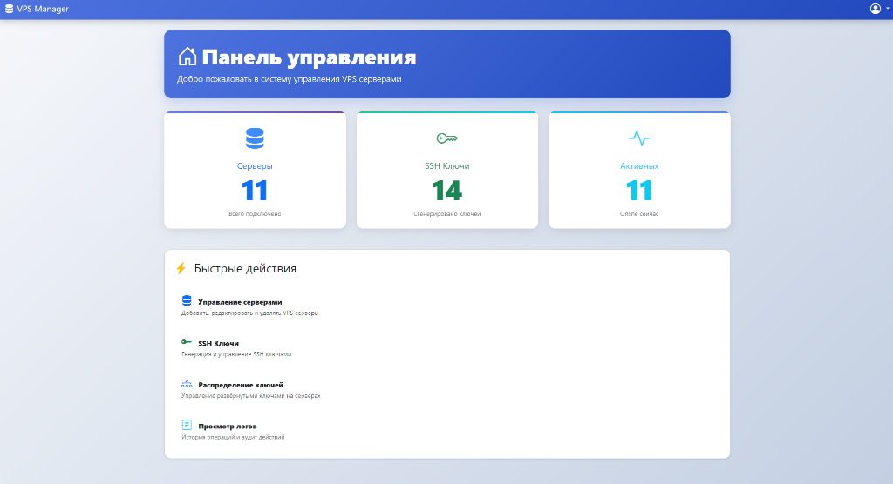

# 🖥️ VPS Manager

Полнофункциональное веб-приложение для управления SSH ключами и развертыванием их на удаленные VPS серверы. Позволяет централизованно управлять доступом к инфраструктуре с поддержкой шифрования и аудита.



---

## ✨ Возможности

### 🔑 Управление SSH-ключами
- **Генерация и загрузка**: Создание RSA-ключей (2048/4096 бит) или загрузка своих публичных ключей
- **Описание и метаданные**: Добавление описания к ключам для удобства идентификации (с тултипом в интерфейсе)
- **Группировка ключей**: Автоматическое разделение на пользовательские и служебные (root_*) ключи. Служебные ключи скрыты под спойлером для чистоты интерфейса
- **Скачивание ключей**: Безопасное скачивание расшифрованного приватного ключа в форматах `.pem` и `.ppk` (PuTTY)
- **Просмотр**: Отображение Fingerprint (MD5), публичного ключа и даты создания
- **Массовые действия**:
  - Развёртывание одного ключа на группу серверов с фильтрацией по тегам/категориям
  - Отзыв ключа со всех серверов одной кнопкой

### 🖥️ Управление серверами
- **CRUD операции**: Добавление, редактирование, удаление серверов
- **Категории и Теги**: Организация серверов по категориям (Prod, Dev, Test) и произвольным тегам для удобной фильтрации
- **Проверка доступности**: Пинг серверов и проверка SSH-подключения
- **Синхронизация**: Обновление информации о хостнейме и ОС
- **Массовый импорт**: Импорт серверов из JSON с автоматическим назначением категорий

### 🚀 Развертывание и безопасность
- **Автоматическое развертывание**: Развертывание публичных ключей на серверы в один клик
- **Шифрование**: Все приватные ключи зашифрованы с использованием Fernet
- **Отзыв доступа**: Отзыв развернутых ключей с серверов (массово или индивидуально)
- **Legacy SSH**: Автоматическое определение и поддержка старых версий OpenSSH

### 📊 Мониторинг и аудит
- **Отслеживание развертываний**: Просмотр статуса развернутых ключей на каждом сервере
- **Аудит и логирование**: Полная история всех действий с IP адресами и временем
- **Диагностика**: Встроенные инструменты для тестирования соединений и отладки

### 🌐 Интерфейс
- **Web интерфейс**: Интуитивный и отзывчивый интерфейс на Flask
- **Фильтрация и поиск**: Фильтрация серверов по категориям и статусу при массовом развёртывании ключей

---

## 📋 Требования

- **Python** 3.8 или выше
- **Flask** 3.0.0
- **SQLAlchemy** 1.4.54 (ORM для работы с БД)
- **Paramiko** 3.4.0 (SSH клиент)
- **Cryptography** 42.0.0 (шифрование)
- **SQLite** (по умолчанию) или другая СУБД

Полный список зависимостей см. в `requirements.txt`

---

## 🚀 Установка

### 1. Клонирование репозитория

```bash
git clone https://github.com/aleksandrgrn/vps-access-manager.git
cd vps-access-manager
```

### 2. Создание виртуального окружения

```bash
# Windows
python -m venv venv
venv\Scripts\activate

# Linux/macOS
python3 -m venv venv
source venv/bin/activate
```

### 3. Установка зависимостей

```bash
pip install -r requirements.txt
```

### 3.1. Поддержка PuTTY (`.ppk`)

Если планируете скачивать приватные ключи в формате `.ppk` для PuTTY, установите `puttygen` на сервере приложения:

```bash
# Ubuntu/Debian
apt install putty-tools

# Проверка
/usr/bin/puttygen --version
```

Для production рекомендуется явно указать путь в `.env`:

```bash
PUTTYGEN_PATH=/usr/bin/puttygen
PPK_TEMP_DIR=/dev/shm
```

> `.ppk` доступен только для ключей, у которых приватная часть хранится в системе.

### 4. Инициализация базы данных

```bash
# Создание таблиц
python init_db.py

# Применение миграций (если есть)
flask db upgrade
```

### 5. Создание файла окружения

Для генерации ключей используйте встроенный скрипт:

```bash
python generate_keys.py
```

Скрипт автоматически сгенерирует:
- **SECRET_KEY** (64-символьный hex для Flask сессий и CSRF)
- **ENCRYPTION_KEY** (Fernet ключ для шифрования SSH-ключей в БД)

Вам будет предложено сохранить ключи в файл `.env` автоматически. Выберите `y` для автоматического сохранения.

Итоговый `.env` файл должен выглядеть так:

```bash
SECRET_KEY=<ваш_сгенерированный_64_char_hex>
ENCRYPTION_KEY=<ваш_сгенерированный_fernet_key>
FLASK_ENV=production
DATABASE_URL=sqlite:///vps_manager.db
```

**Альтернативный способ (вручную):**

Если вы хотите создать `.env` вручную:

```bash
# SECRET_KEY
python -c "import secrets; print('SECRET_KEY=' + secrets.token_hex(32))"

# ENCRYPTION_KEY
python -c "from cryptography.fernet import Fernet; print('ENCRYPTION_KEY=' + Fernet.generate_key().decode())"
```

**⚠️ Важно для production:**
- Используйте **уникальные** ключи (не копируйте примеры!)
- **НИКОГДА** не коммитьте `.env` в Git
- Сохраните **backup** ключей (без `ENCRYPTION_KEY` невозможно расшифровать SSH-ключи)
- Для разработки используйте `FLASK_ENV=development` 

**Проверьте `.gitignore`:**
```bash
# Убедитесь что .env игнорируется
grep -q "^\.env$" .gitignore || echo ".env" >> .gitignore
```

### ⚠️ Важно для HTTP

Если разворачиваете без SSL, измените `SESSION_COOKIE_SECURE` в `app/__init__.py` на `False`. Подробности в [QUICK_START.md](QUICK_START.md).


---

## 🎯 Первый запуск

### 1. Создание администратора

```bash
python seed_db.py
```

Вывод:
```
✅ Default admin user created!
   Username: admin
   Password: admin
⚠️  ВАЖНО: Смените пароль после первого входа!
```

### 2. Запуск приложения

**Режим разработки:**
```bash
python run.py
```

**Production режим с Gunicorn:**
```bash
gunicorn -w 4 -b 0.0.0.0:5000 "run:app"
```

Приложение будет доступно по адресу: `http://localhost:5000`

### 3. Вход в систему

- **Логин:** `admin`
- **Пароль:** `admin`

### 4. ⚠️ Смена пароля

После первого входа обязательно смените пароль администратора через интерфейс приложения.

---

## 📁 Структура проекта

Проект использует модульную архитектуру на основе **Flask Blueprints** для лучшей масштабируемости и поддержки:

```
vps-access-manager/
├── app/                          # Главный пакет приложения
│   ├── __init__.py               # Application factory (create_app)
│   ├── models.py                 # SQLAlchemy модели (User, Server, SSHKey, etc.)
│   ├── forms.py                  # WTForms для валидации
│   ├── utils.py                  # Утилиты (логирование, декораторы)
│   ├── routes/                   # Blueprint модули
│   │   ├── __init__.py
│   │   ├── auth.py               # Аутентификация (login, logout)
│   │   ├── servers.py            # Управление серверами
│   │   ├── keys.py               # Управление SSH ключами
│   │   └── deployments.py        # Развертывания и отзывы
│   └── services/                 # Бизнес-логика
│       ├── __init__.py
│       ├── deployment_service.py # Логика развертывания
│       ├── key_service.py        # Управление ключами
│       └── ssh/                  # Модуль SSH
│           ├── connection.py     # Управление соединением
│           ├── keys.py           # Работа с ключами
│           ├── operations.py     # Высокоуровневые операции
│           └── server_manager.py # Управление сервером
├── templates/                    # Jinja2 шаблоны
│   ├── base.html
│   ├── dashboard.html
│   ├── servers.html
│   ├── keys.html
│   └── key-deployments.html
├── static/                       # Статические файлы
│   ├── css/
│   │   └── style.css
│   └── js/
│       └── main.js
├── migrations/                   # Alembic миграции БД
├── logs/                         # Логи приложения
├── run.py                        # Точка входа приложения
├── init_db.py                    # Инициализация БД
├── seed_db.py                    # Создание тестовых данных
├── requirements.txt              # Python зависимости
├── .env                          # Переменные окружения
└── vps_manager.db                # SQLite база данных
```

### Преимущества новой архитектуры

- **Модульность** — каждый Blueprint отвечает за свою область (auth, servers, keys, deployments)
- **Разделение ответственности** — routes (маршруты) → services (бизнес-логика) → models (данные)
- **Масштабируемость** — легко добавлять новые модули без изменения существующего кода
- **Тестируемость** — изолированные компоненты проще тестировать
- **Application Factory** — создание приложения через `create_app()` для гибкой конфигурации
- **Production-ready** — готовая структура для развертывания с Gunicorn/uWSGI

### Blueprints и маршруты

Все API маршруты используют префикс `/api` для разделения API и веб-интерфейса:

- **auth** — `/login`, `/logout` (без префикса)
- **servers** — `/api/servers/*`, `/api/dashboard`, `/api/logs`
- **keys** — `/api/keys/*`
- **deployments** — `/api/key-deployments/*`

---

## 🛠️ Служебные скрипты

### `generate_keys.py` — Генератор ключей для production

Используется для генерации безопасных ключей шифрования и сессий:

```bash
python generate_keys.py
```

**Что делает:**
- Генерирует `SECRET_KEY` (64-символьный hex) для Flask сессий и CSRF защиты
- Генерирует `ENCRYPTION_KEY` (Fernet ключ) для шифрования SSH-ключей в БД
- Показывает ключи в консоли
- Предлагает автоматически сохранить в файл `.env`

**Когда использовать:**
- При первоначальной установке (production)
- При необходимости ротации ключей
- При развертывании на новом сервере

**⚠️ Важно:**
- Сохраняйте `ENCRYPTION_KEY` в безопасном месте (без него невозможно расшифровать SSH-ключи)
- Никогда не коммитьте `.env` в Git
- Используйте разные ключи для разных окружений (dev, staging, production)

### `run.py` — Точка входа приложения

Запускает Flask приложение с логированием:

```bash
# Режим разработки (debug mode)
python run.py

# Production режим (без debug)
FLASK_ENV=production python run.py

# С Gunicorn (production)
gunicorn -w 4 -b 0.0.0.0:5000 "run:app"
```

**Что делает:**
- Создает Flask приложение через `create_app()` factory
- Настраивает логирование в файл `logs/vps_manager.log`
- Использует ротирующиеся логи (max 10MB, 10 файлов)
- Запускает встроенный сервер на `http://127.0.0.1:5000`

### `init_db.py` — Инициализация базы данных

Создает таблицы БД:

```bash
python init_db.py
```

**Что делает:**
- Создает все таблицы SQLAlchemy моделей
- Применяет миграции Alembic (если есть)
- Выводит статус инициализации

### `seed_db.py` — Создание тестовых данных

Создает администратора по умолчанию:

```bash
python seed_db.py
```

**Что делает:**
- Создает пользователя `admin` с паролем `admin`
- Проверяет, не существует ли уже такой пользователь
- Выводит учетные данные для входа

**⚠️ Важно:**
- Используйте только для разработки и тестирования
- Обязательно смените пароль после первого входа в production

---

## 📖 Рабочий процесс

### Типичный сценарий: Развертывание доступа на новый сервер

#### Шаг 1️⃣ Добавить SSH ключ

1. Перейти в раздел **"Ключи"**
2. Выбрать один из вариантов:
   - **Сгенерировать новый** — выбрать тип (RSA 4096 или Ed25519)
   - **Загрузить существующий** — вставить публичный ключ

При просмотре сгенерированного ключа в модальном окне доступны кнопки:
- **Скачать .pem** — для OpenSSH-клиентов
- **Скачать .ppk** — для PuTTY/Windows

#### Шаг 2️⃣ Добавить сервер

1. Перейти в раздел **"Серверы"**
2. Нажать **"Добавить сервер"**
3. Заполнить форму:
   - Название сервера (например, `prod-web-01`)
   - IP адрес (например, `192.168.1.100`)
   - SSH порт (по умолчанию `22`)
   - Имя пользователя (например, `root` или `ubuntu`)

#### Шаг 2.5️⃣ Организовать серверы по категориям (опционально)

1. Перейти в раздел **"Серверы"**
2. Нажать **"Категории"**
3. Создать категории (например, `Production`, `Staging`, `External`)
4. При добавлении/редактировании сервера выбрать категории из списка

**Преимущества:**
- Быстрая фильтрация серверов при массовом развёртывании ключей
- Визуальная группировка в интерфейсе
- Цветовая маркировка для удобства навигации

#### Шаг 3️⃣ Развернуть ключ на сервер(ы)

**Вариант A: Одиночное развёртывание**
1. На странице **"Серверы"** найти нужный сервер
2. Нажать **"Развернуть ключ"**
3. Выбрать SSH ключ из списка
4. Нажать **"Развернуть"**

**Вариант B: Массовое развёртывание**
1. На странице **"Ключи"** нажать кнопку массового развёртывания
2. Использовать фильтры:
   - **По статусу** — выбрать только Online/Offline серверы
   - **По категории** — выбрать серверы определённой категории (например, `Production`)
3. Отметить нужные серверы галочками
4. Нажать **"Развернуть"**

Система автоматически:
- Подключится к каждому серверу параллельно
- Добавит публичный ключ в `~/.ssh/authorized_keys`
- Покажет результат (успешно/пропущено/ошибка) для каждого сервера
- Зарегистрирует развертывание в БД

#### Шаг 4️⃣ Проверить доступ

1. Нажать **"Тест соединения"** для проверки статуса сервера
2. Перейти в **"Развертывания"** для просмотра истории

#### Шаг 5️⃣ Отозвать доступ (при необходимости)

1. На странице **"Развертывания"** найти нужное развертывание
2. Нажать **"Отозвать"**
3. Система удалит ключ из `authorized_keys` на сервере

---

## 🔌 API Endpoints

### Authentication (без префикса)
| Метод | Endpoint | Описание | Требует Auth |
|-------|----------|---------|--------------|
| GET | `/` | Главная страница (редирект на login/dashboard) | ✓ |
| GET/POST | `/login` | Вход в систему | ✗ |
| GET | `/logout` | Выход из системы | ✓ |

### Servers Blueprint (`/api`)
| Метод | Endpoint | Описание | Требует Auth |
|-------|----------|---------|--------------|
| GET | `/api/dashboard` | Главная панель управления | ✓ |
| GET | `/api/servers` | Список серверов пользователя | ✓ |
| POST | `/api/servers/add` | Добавить новый сервер | ✓ |
| POST | `/api/servers/edit/<id>` | Редактировать сервер | ✓ |
| POST | `/api/servers/delete/<id>` | Удалить сервер | ✓ |
| POST | `/api/servers/test/<id>` | Тест соединения с сервером | ✓ |
| POST | `/api/bulk-import-servers` | Массовый импорт серверов с категориями (JSON) | ✓ |
| GET | `/api/categories` | Список категорий пользователя | ✓ |
| POST | `/api/categories` | Создать новую категорию | ✓ |
| DELETE | `/api/categories/<id>` | Удалить категорию | ✓ |
| GET | `/api/logs` | Журнал аудита | ✓ |

### Keys Blueprint (`/api`)
| Метод | Endpoint | Описание | Требует Auth |
|-------|----------|---------|--------------|
| GET | `/api/keys` | Список SSH ключей пользователя | ✓ |
| GET | `/api/keys/download/<id>` | Скачать приватный ключ в формате `.pem` | ✓ |
| GET | `/api/keys/download/<id>/ppk` | Скачать приватный ключ в формате `.ppk` | ✓ |
| POST | `/api/keys/generate` | Сгенерировать новый SSH ключ | ✓ |
| POST | `/api/keys/upload` | Загрузить существующий ключ | ✓ |
| POST | `/api/keys/deploy` | Развернуть ключ на сервер | ✓ |
| POST | `/api/keys/delete/<id>` | Удалить SSH ключ | ✓ |
| POST | `/api/keys/revoke-all/<id>` | Отозвать ключ со всех серверов | ✓ |
| GET | `/api/key-servers/<id>` | Список серверов с развернутым ключом | ✓ |

### Deployments Blueprint (`/api`)
| Метод | Endpoint | Описание | Требует Auth |
|-------|----------|---------|--------------|
| GET | `/api/key-deployments` | История развертываний ключей | ✓ |
| POST | `/api/key-deployments/revoke` | Отозвать развернутый ключ | ✓ |
| POST | `/api/key-deployments/filter` | Фильтрация развертываний | ✓ |

---

## 🗄️ Структура базы данных

### Таблица `users`
Хранит информацию о пользователях системы.

| Поле | Тип | Описание |
|------|-----|---------|
| `id` | INTEGER | Первичный ключ |
| `username` | STRING(80) | Уникальное имя пользователя |
| `password_hash` | STRING(256) | Хеш пароля (Werkzeug) |
| `is_admin` | BOOLEAN | Флаг администратора |
| `created_at` | TIMESTAMP | Дата создания |

### Таблица `servers`
Хранит информацию о VPS серверах.

| Поле | Тип | Описание |
|------|-----|---------|
| `id` | INTEGER | Первичный ключ |
| `name` | STRING(100) | Название сервера |
| `ip_address` | STRING(45) | IP адрес (IPv4/IPv6) |
| `ssh_port` | INTEGER | SSH порт (по умолчанию 22) |
| `username` | STRING(100) | Пользователь для SSH |
| `status` | STRING(20) | Статус (`online`, `offline`, `unknown`) |
| `last_check` | TIMESTAMP | Время последней проверки |
| `openssh_version` | STRING(20) | Версия OpenSSH на сервере |
| `requires_legacy_ssh` | BOOLEAN | Требуется ли legacy SSH алгоритм |
| `access_key_id` | INTEGER (FK) | ID ключа для доступа к серверу |
| `user_id` | INTEGER (FK) | ID владельца сервера |
| `created_at` | TIMESTAMP | Дата добавления |

### Таблица `server_categories`
Хранит категории для группировки серверов.

| Поле | Тип | Описание |
|------|-----|---------|
| `id` | INTEGER | Первичный ключ |
| `name` | STRING(50) | Название категории (уникально) |
| `color` | STRING(7) | Цвет категории (HEX, например `#198754`) |
| `created_at` | TIMESTAMP | Дата создания |

### Таблица `server_category_association`
Связь many-to-many между серверами и категориями.

| Поле | Тип | Описание |
|------|-----|---------|
| `server_id` | INTEGER (FK) | ID сервера |
| `category_id` | INTEGER (FK) | ID категории |

### Таблица `ssh_keys`
Хранит SSH ключи пользователей (приватные ключи зашифрованы).

| Поле | Тип | Описание |
|------|-----|---------|
| `id` | INTEGER | Первичный ключ |
| `name` | STRING(100) | Название ключа |
| `description` | TEXT | Описание ключа (опционально) |
| `public_key` | TEXT | Публичный ключ (открытый текст) |
| `private_key_encrypted` | BLOB | Приватный ключ (зашифрован Fernet) |
| `fingerprint` | STRING(100) | Отпечаток ключа (уникален) |
| `key_type` | STRING(20) | Тип ключа (`rsa`, `ed25519`) |
| `user_id` | INTEGER (FK) | ID владельца ключа |
| `created_at` | TIMESTAMP | Дата создания |

### Таблица `key_deployments`
Отслеживает развертывание ключей на серверы.

| Поле | Тип | Описание |
|------|-----|---------|
| `id` | INTEGER | Первичный ключ |
| `ssh_key_id` | INTEGER (FK) | ID SSH ключа |
| `server_id` | INTEGER (FK) | ID сервера |
| `deployed_at` | TIMESTAMP | Дата развертывания |
| `deployed_by` | INTEGER (FK) | ID пользователя, развернувшего ключ |
| `revoked_at` | TIMESTAMP | Дата отзыва (NULL если активен) |
| `revoked_by` | INTEGER (FK) | ID пользователя, отозвавшего ключ |

### Таблица `logs`
Журнал аудита всех действий в системе.

| Поле | Тип | Описание |
|------|-----|---------|
| `id` | INTEGER | Первичный ключ |
| `user_id` | INTEGER (FK) | ID пользователя |
| `action` | STRING(100) | Тип действия (`login_success`, `deploy_key`, и т.д.) |
| `target` | STRING(100) | Объект действия (имя сервера, ключа) |
| `details` | TEXT | Дополнительные данные (JSON) |
| `ip_address` | STRING(45) | IP адрес клиента |
| `timestamp` | TIMESTAMP | Время действия |

---

## 🔧 Диагностика и решение проблем

### Проблема: Не удается подключиться к серверу

```bash
# 1. Проверить статус сервера через интерфейс
# Нажать "Тест соединения" на странице серверов

# 2. Проверить логи приложения
tail -f logs/app.log

# 3. Проверить SSH соединение вручную
ssh -i ~/.ssh/your_key.pem -p 22 user@192.168.1.100

# 4. Проверить конфигурацию SSH на сервере
ssh user@192.168.1.100 "cat ~/.ssh/authorized_keys"
```

### Проблема: Ошибка при развертывании ключа

```bash
# 1. Проверить права доступа на сервере
ssh user@server "ls -la ~/.ssh/"

# 2. Проверить размер файла authorized_keys
ssh user@server "wc -l ~/.ssh/authorized_keys"

# 3. Проверить логи SSH сервера
ssh user@server "tail -20 /var/log/auth.log"

# 4. Проверить, что ключ в правильном формате
python -c "from cryptography.hazmat.primitives import serialization; print('OK')"
```

### Проблема: Ошибка шифрования

```bash
# 1. Проверить переменную ENCRYPTION_KEY в .env
grep ENCRYPTION_KEY .env

# 2. Проверить, что ключ в формате base64
python -c "import base64; base64.b64decode('<your_key>')"

# 3. Пересоздать ключ шифрования
python -c "from cryptography.fernet import Fernet; print(Fernet.generate_key().decode())"
```

### Проблема: Ошибка БД

```bash
# 1. Проверить файл БД
ls -lh vps_manager.db

# 2. Пересоздать БД (ВНИМАНИЕ: потеря данных!)
rm vps_manager.db
python init_db.py
python seed_db.py

# 3. Проверить миграции
flask db current
flask db history
```

### Проблема: Legacy SSH алгоритмы

```bash
# 1. Проверить версию OpenSSH на сервере
ssh user@server "ssh -V"

# 2. Если версия < 7.0, система автоматически включит поддержку legacy алгоритмов
# Проверить флаг requires_legacy_ssh в БД

# 3. Для ручного включения legacy алгоритмов:
# Отредактировать конфиг SSH клиента ~/.ssh/config
Host old-server
    HostName 192.168.1.100
    User root
    PubkeyAcceptedAlgorithms +ssh-rsa
    HostkeyAlgorithms +ssh-rsa
```

### Команды диагностики

```bash
# Проверить подключение к БД
python -c "from app import create_app, db; app = create_app(); app.app_context().push(); db.create_all(); print('✅ DB OK')"

# Проверить шифрование
python -c "from cryptography.fernet import Fernet; import os; key = os.environ.get('ENCRYPTION_KEY'); print('✅ Encryption OK' if key else '❌ No key')"

# Проверить SSH конфиг
python -c "import paramiko; print('✅ Paramiko OK')"

# Запустить тесты
pytest tests/ -v
```

---

## 🧪 Тестирование

Для запуска E2E тестов необходимо настроить переменные окружения:

- `TEST_SSH_IP`: IP адрес тестового сервера
- `TEST_SSH_PORT`: Порт SSH (по умолчанию 22)
- `TEST_SSH_USER`: Пользователь для подключения
- `TEST_SSH_PASSWORD`: Пароль пользователя
- `TEST_SSH_KEY_PATH`: Путь к приватному ключу (опционально)

```bash
# Запуск тестов
pytest tests/ -v
```

---

## 🔐 Безопасность

### Шифрование приватных ключей

Все приватные SSH ключи хранятся в БД в зашифрованном виде с использованием **Fernet** (симметричное шифрование):

```python
from cryptography.fernet import Fernet

# Генерация ключа
key = Fernet.generate_key()  # Сохранить в ENCRYPTION_KEY

# Шифрование
cipher = Fernet(key)
encrypted = cipher.encrypt(private_key_bytes)

# Расшифровка
decrypted = cipher.decrypt(encrypted)
```

### SFTP и SSH соединения

Приложение использует **Paramiko** для безопасного подключения к серверам:

- Поддержка RSA 4096 и Ed25519 ключей
- Проверка хостов через `known_hosts.json`
- Таймауты соединений (30 сек)
- Логирование всех операций

### Legacy SSH алгоритмы

Для старых серверов (OpenSSH < 7.0) система автоматически:

1. Определяет версию OpenSSH при первом подключении
2. Устанавливает флаг `requires_legacy_ssh`
3. Использует расширенные алгоритмы при необходимости

```python
# Пример конфигурации для legacy SSH
ssh_config = {
    'look_for_keys': False,
    'allow_agent': False,
    'disabled_algorithms': {
        'pubkeys': ['rsa-sha2-512', 'rsa-sha2-256']
    }
}
```

### Сессии и аутентификация

- **Session cookies** с флагами `HttpOnly`, `Secure`, `SameSite=Lax`
- **CSRF protection** через Flask-WTF
- **Пароли** хешируются с Werkzeug (`pbkdf2:sha256`)
- **Логирование** всех попыток входа (успешные и неудачные)

### Аудит

Все действия логируются в таблицу `logs`:

- Вход/выход пользователя
- Создание/удаление ключей
- Развертывание/отзыв ключей
- Добавление/удаление серверов
- IP адрес и время действия

---

## 📝 Лицензия

Этот проект распространяется под лицензией **MIT**. Подробнее см. в файле `LICENSE`.

---

## 🤝 Поддержка

Если у вас возникли проблемы или вопросы:

1. Проверьте раздел **"Диагностика"** выше
2. Посмотрите логи: `tail -f logs/app.log`
3. Проверьте файл `.env` и переменные окружения
4. Убедитесь, что все зависимости установлены: `pip list`

---

## 📚 Дополнительные ресурсы

- **ARCHITECTURE.md** — архитектура и описание модулей
- **DEPLOYMENT_GUIDE.md** — подробное руководство по развертыванию
- **QUICK_START.md** — быстрый старт

---

## 📝 Последние обновления (v4.0)

- **UI/UX**: Улучшен интерфейс управления ключами (скрытие служебных ключей, модальные окна, тултипы)
- **Безопасность**: Добавлена возможность скачивания приватных ключей в формате `.pem`
- **Фильтры**: Расширенные фильтры при выборе серверов для деплоя (по категориям и статусу)
- **База данных**: Миграция схемы для поддержки описаний ключей (`description` поле)
- **Категории**: Полная поддержка категорий серверов с цветовой маркировкой
- **Массовые операции**: Улучшенный импорт серверов с детальными результатами

---

**Версия:** 4.0  
**Последнее обновление:** Декабрь 2025  
**Язык:** Python 3.8+  
**Framework:** Flask 3.0.0  
**Архитектура:** Flask Blueprints + Application Factory
